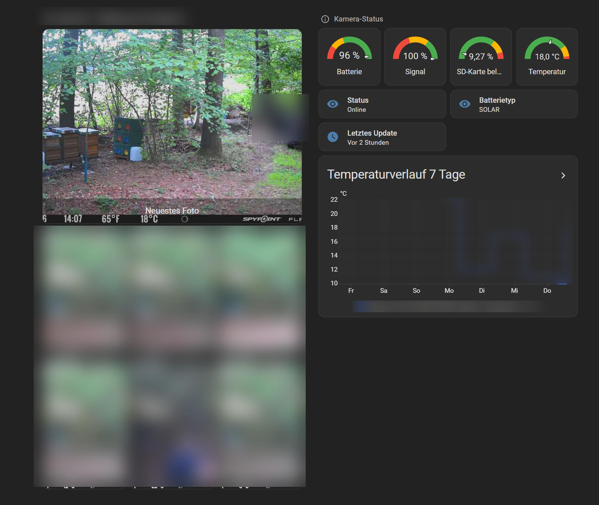

# SpyPoint Photo Kiosk for Home Assistant

Download photos from a SpyPoint cellular trail camera and show them as a
kiosk dashboard in Home Assistant — with a push notification whenever a
new photo arrives.



## Why this exists

The official [SpyPoint HACS integration](https://github.com/happydev-ca/spypoint-home-assistant)
only exposes **sensors** (battery, signal strength, status, etc.) for your
camera. It does **not** pull down the actual photos, even though they're
visible in the SpyPoint app. This project fills that gap with:

- a small Python script that logs into SpyPoint and downloads new photos
- a Home Assistant setup that turns those photos into camera entities
- a dashboard view showing the latest photos
- a push notification (with image preview) whenever a new photo lands
- optional **person detection** with a small local AI model (no cloud):
  get a push only when a human is on the photo — e.g. as theft protection

## Architecture

```
SpyPoint cloud
      │  (pyspypoint library)
      ▼
spypoint_download.py  (runs via cron on the machine hosting HA)
      │  writes .jpg files to a folder, keeps a "latest" subfolder
      │  with fixed filenames (latest_1.jpg … latest_N.jpg)
      ▼
Docker volume mount  →  /media/spypoint  inside the HA container
      │
      ├─ local_file integration  →  camera.spypoint_foto_1 … _N
      ├─ folder_watcher integration  →  fires on new downloads
      └─ automation  →  push notification with photo attached

optional: spypoint_personen.py (YOLO11n, ONNX, CPU-only)
      │  checks every NEW photo for people
      ▼
copies hits to  spypoint-photos/personen/  →  separate "person" alert
```

## Prerequisites

- Home Assistant running (this was built against a Docker install, but
  the HA-side steps work the same for any install as long as you can
  mount/reach the photo folder from the HA container or host)
- A machine that can run Python and cron independently of HA (e.g. the
  same host if HA runs in Docker there, or any other always-on machine
  with access to the same filesystem/volume)
- A SpyPoint account with at least one camera

## 1. Install the downloader script

```bash
python3 -m venv ~/spypoint-env
source ~/spypoint-env/bin/activate
pip install -r requirements.txt
```

(Without person detection, `pip install pyspypoint requests` is enough.)

Copy [`spypoint_download.py`](spypoint_download.py) to your machine, e.g.
`~/spypoint_download.py`.

Store your SpyPoint credentials as environment variables rather than in
the script itself. One simple way: a file only you can read, sourced
before running the script.

```bash
cat > ~/.spypoint_credentials << 'EOF'
export SPYPOINT_USERNAME="you@example.com"
export SPYPOINT_PASSWORD="your-password"
EOF
chmod 600 ~/.spypoint_credentials
```

Test it once:

```bash
source ~/.spypoint_credentials
~/spypoint-env/bin/python3 ~/spypoint_download.py
ls -la ~/spypoint-photos/latest/
```

You should see `latest_1.jpg` (newest) through `latest_7.jpg`
(default: 7 — see `LATEST_COUNT` in the script).

Then add a cron job to run it periodically, e.g. every 30 minutes:

```bash
crontab -e
# add:
*/30 * * * * . /home/YOUR_USER/.spypoint_credentials && /home/YOUR_USER/spypoint-env/bin/python3 /home/YOUR_USER/spypoint_download.py
```

**Use `.`, not `source`.** Cron runs jobs with `/bin/sh` (usually `dash` on
Debian/Raspberry Pi OS), not `bash`. `source` is a bash-only builtin and
doesn't exist in `sh` — with `source` the job fails immediately with
`sh: 1: source: not found`, before the Python script ever runs. `.` is the
POSIX-standard equivalent and works the same under both shells. Most fresh
installs have no mail system configured, so this failure is silent (you'll
just see `(CRON) info (No MTA installed, discarding output)` in
`journalctl -u cron`) — it's easy to think the job is running fine when it
isn't.

## 2. Mount the photo folder into Home Assistant

If HA runs in Docker, add a volume to your compose file / `docker run`:

```yaml
volumes:
  - /home/YOUR_USER/spypoint-photos:/media/spypoint
```

Restart the container, then confirm HA can see the files:

```bash
docker exec homeassistant ls -lah /media/spypoint
```

## 3. Set up the Home Assistant integrations

**Important:** on current Home Assistant versions, both `local_file`
(camera) and `folder_watcher` are **UI-only integrations** — they no
longer accept `platform: local_file` / `folder_watcher:` blocks in
`configuration.yaml`. If you add them as YAML, HA will show a repair
error telling you to remove them and set them up via the UI instead.

Go to **Settings → Devices & Services → Add Integration**:

- Add **Local File** once per photo slot, pointing at
  `/media/spypoint/latest/latest_1.jpg`, `latest_2.jpg`, … Name them
  something like `SpyPoint Foto 1`, `SpyPoint Foto 2`, etc. This gives
  you entities `camera.spypoint_foto_1` … `_N`.
- Add **Folder Watcher** once, folder `/media/spypoint`, pattern
  `*.jpg`. Point it at the **top-level** folder only (not the `latest`
  subfolder) — otherwise the script's own housekeeping copies into
  `latest/` will trigger false "new photo" events.

You'll also want `allowlist_external_dirs` set in `configuration.yaml`
(this key itself is still plain YAML, unlike the two integrations above):

```yaml
homeassistant:
  allowlist_external_dirs:
    - /media/spypoint
```

## 4. Notification automation

See [`examples/automation.yaml`](examples/automation.yaml). Adjust the
`notify.mobile_app_YOUR_DEVICE` action to your own device's notify
service — find it under **Developer Tools → Actions**, search
`mobile_app`.

**Note on `notify.send_message`:** newer Home Assistant versions
introduced a unified `notify.send_message` action targeting notify
*entities*. It's the modern, recommended way to send notifications, but
as of this writing it only accepts `message` and `title` — no `data`
block, so **no image attachments**. For a photo preview in the push
notification you need the classic per-device action
(`notify.mobile_app_<device>`), which still works even on setups that
have otherwise migrated to notify entities.

The image path uses Home Assistant's `/media/local/...` convention: a
file at `/media/spypoint/foo.jpg` on disk is referenced as
`/media/local/spypoint/foo.jpg` in a notification — this gets
authenticated automatically by the companion app, no public URL needed.

## 5. Dashboard

See [`examples/dashboard-view.yaml`](examples/dashboard-view.yaml) for a
`sections`-type view: one large "latest photo" card, smaller cards for
the rest, and a status panel with gauges for battery/signal/SD card
usage plus a history graph.

If your dashboard is in **storage mode** (the default — no `lovelace:`
key in `configuration.yaml`), you can't just drop in a YAML file.
Create a new view in the UI, then use its three-dot menu →
**"Edit in YAML"** and paste the section content in.

## 6. Optional: person detection (theft protection)

A trail camera mostly photographs animals, grass and moving branches. If
you only want to be alerted when a **person** shows up, the downloader can
run a small object-detection model on every new photo — entirely locally,
no cloud service, no PyTorch at runtime.

How it works:

- [`spypoint_personen.py`](spypoint_personen.py) loads
  [YOLO11n](https://docs.ultralytics.com/models/yolo11/) exported to ONNX
  (~10 MB) with `onnxruntime` and returns the highest "person" confidence
  for a photo.
- `spypoint_download.py` calls it for each **newly downloaded** photo (old
  photos are never re-checked). Photos at or above `MIN_CONFIDENCE`
  (default `0.30`) are additionally copied to `spypoint-photos/personen/`.
- [`examples/automation-person-alert.yaml`](examples/automation-person-alert.yaml)
  only fires for files in that `personen/` folder.
- If the module, the model or one of its libraries is missing, the
  downloader logs an error and keeps downloading as usual.

### Install

1. Put `spypoint_personen.py` in the **same folder** as
   `spypoint_download.py`.
2. Install the extra libraries (already in `requirements.txt`):
   `onnxruntime`, `numpy`, `pillow`.
3. Create the model file. Ultralytics only ships PyTorch weights, so export
   them to ONNX once — in a **throwaway venv**, since `ultralytics` pulls in
   PyTorch (several GB). It doesn't have to be on the target machine; the
   `.onnx` file is portable.

   ```bash
   python3 -m venv /tmp/yoloexport
   /tmp/yoloexport/bin/pip install --extra-index-url https://download.pytorch.org/whl/cpu ultralytics onnx onnxslim
   cd /tmp && /tmp/yoloexport/bin/yolo export model=yolo11n.pt format=onnx imgsz=640
   mkdir -p ~/spypoint-models && mv /tmp/yolo11n.onnx ~/spypoint-models/
   rm -rf /tmp/yoloexport /tmp/yolo11n.pt
   ```

   On a headless machine, if the export fails on a missing `libGL`,
   replace OpenCV with the headless build in the export venv:
   `pip uninstall -y opencv-python && pip install opencv-python-headless`.

   The script looks for `~/spypoint-models/yolo11n.onnx`; set the
   environment variable `SPYPOINT_MODEL` (e.g. in `~/.spypoint_credentials`)
   to use a different path.

4. Test it on a few of your own photos:

   ```bash
   ~/spypoint-env/bin/python3 ~/spypoint_personen.py ~/spypoint-photos/*.jpg
   ```

   Each line shows `PERSON` or `------`, the confidence and the filename.
   Adjust `MIN_CONFIDENCE` in `spypoint_personen.py` if needed — on the
   83 test photos this was tuned with, people scored ≥ 0.32 and empty
   scenes ≤ 0.11.

5. Import [`examples/automation-person-alert.yaml`](examples/automation-person-alert.yaml)
   (instead of, or alongside, the "every new photo" automation).

**Performance:** on a Raspberry Pi 5 one photo takes well under a second.
The script limits `onnxruntime` to 2 threads so it doesn't starve Home
Assistant on the same machine.

**Model license:** YOLO11 weights are published by Ultralytics under
AGPL-3.0 (commercial licenses available). The model is **not** included
in this repository; you download and export it yourself. This project's
own code stays MIT.

## Known pitfalls (things that bit us building this)

- **SpyPoint photo URLs are signed and expire.** They include a
  time-limited signature token that changes on every API call, even for
  the *same* photo. Don't deduplicate downloads by hashing the full URL
  — hash/compare the **filename** instead (or just check whether the
  file already exists on disk). Otherwise every cron run will
  "helpfully" re-download everything.
- **The API returns newest-first, but don't re-sort by download/file
  mtime.** Downloads happen sequentially, so the *last* file written in
  a batch gets the newest mtime on disk — even though it's actually the
  *oldest* photo in that batch. Sort the "latest N" selection by the
  capture timestamp encoded in the filename instead, never by
  filesystem mtime.
- **`local_file` and `folder_watcher` are config-entry-only now.** YAML
  platform config for these silently doesn't apply on current HA
  versions (with a repair-issue warning) — use Settings → Devices &
  Services.
- **`notify.send_message` can't send images (yet).** Use the legacy
  per-device `notify.mobile_app_<device>` action if you need an image
  attachment in the push notification.
- **`source` in a crontab silently breaks on Debian/Raspberry Pi OS.**
  Cron runs jobs with `/bin/sh`, not `bash`, and `source` doesn't exist
  there. Use `.` instead (see step 1) — otherwise every run fails
  instantly and, with no mail system configured, leaves no visible error
  at all.

## Credits

Built using [`pyspypoint`](https://github.com/hstern/pyspypoint), an
unofficial Python client for the SpyPoint cloud API.

## License

MIT — see [LICENSE](LICENSE).
